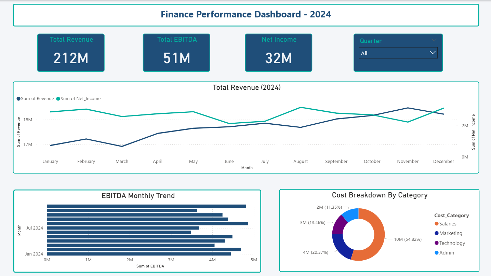
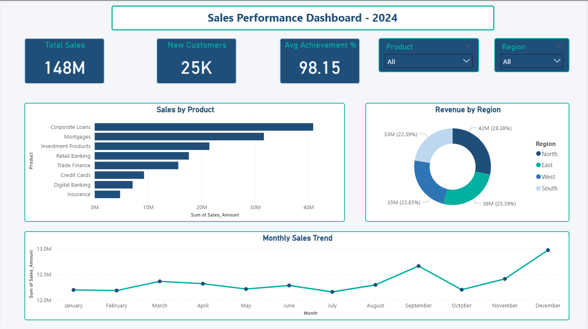

# Finance & Banking KPI Dashboard — Power BI

## Overview
A 4-page executive dashboard built for a finance & banking company 
to replace manual Excel reporting with real-time KPI visibility.

## Problem Solved
Leadership had no unified view of P&L, sales performance, 
or budget variances — reports took 3 days to compile manually.

## Dashboard Pages
- Page 1 — P&L Overview (Revenue, EBITDA, Net Income)
- Page 2 — Sales Performance (Product & Region analysis)
- Page 3 — Budget vs Actuals (Waterfall, Variance analysis)
- Page 4 — Executive KPI Scorecard (NPS, Digital Adoption, Margins)

## Tools & Skills
Power BI | DAX | Power Query | Waterfall Chart | 
Conditional Formatting | KPI Cards

## Key Insights
- Total Revenue: ₹212M | Net Income: ₹32M
- EBITDA Margin tracked monthly vs target
- Budget variance flagged automatically in red/green

  ## 📸 Dashboard Screenshots

### Page 1 — P&L Overview

### Page 2 — Sales Performance

