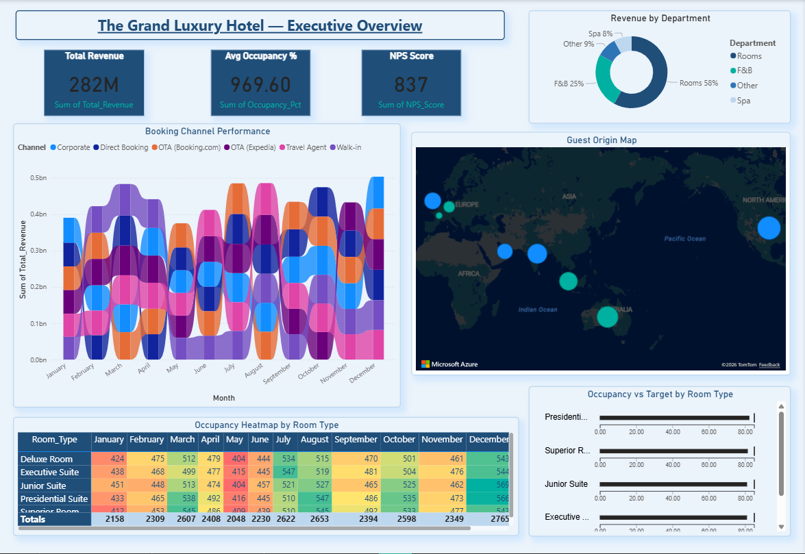
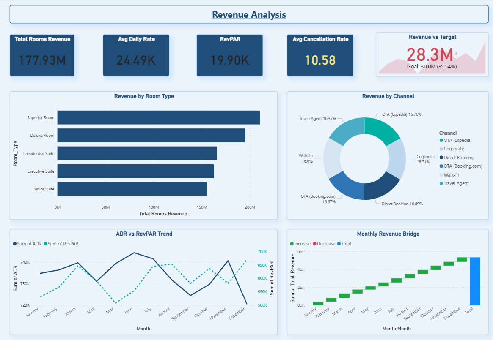
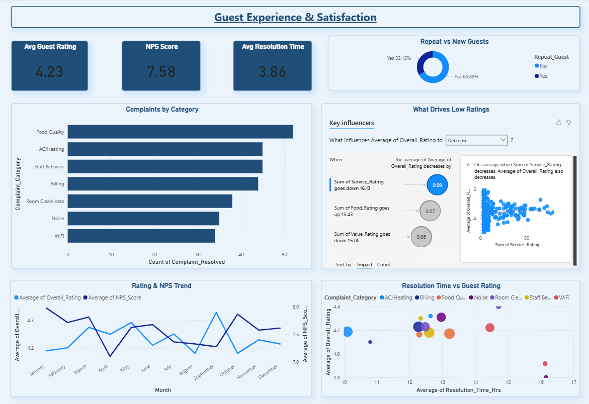
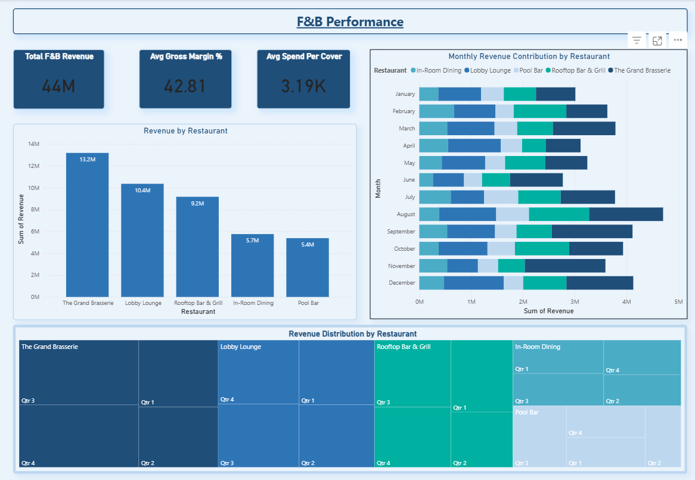

# 5-Star Hotel Executive Dashboard — Power BI

## Overview
A 5-page hospitality analytics dashboard for The Grand Luxury Hotel 
— solving fragmented data across PMS, Restaurant POS, and HR systems.

## Problem Solved
Leadership made decisions from weekly Excel reports — 
no real-time view of occupancy, F&B performance, or guest satisfaction.

## Dashboard Pages
- Page 1 — Executive Overview (RevPAR, ADR, Occupancy, NPS)
- Page 2 — Revenue Analysis (Channel, Room Type, ADR trend)
- Page 3 — Guest Experience (AI Key Influencers, Complaints, NPS)
- Page 4 — F&B Performance (Restaurant revenue, margins, covers)
- Page 5 — Operations & Staff (Dept KPIs, labor cost, attendance)

## Tools & Skills
Power BI | DAX | Power Query | World Map | Ribbon Chart |
Key Influencers (AI) | Heatmap Matrix | Decomposition Tree

## Key Insights
- Total Revenue: ₹282M | Avg Occupancy: 80%
- Food Quality = #1 guest complaint category
- Grand Brasserie top F&B outlet at ₹13.2M revenue

  ## 📸 Dashboard Screenshots

### Page 1 — Executive Overview

### Page 2 — Revenue Analysis

### Page 3 — Guest Experience

### Page 4 — F&B Performance

