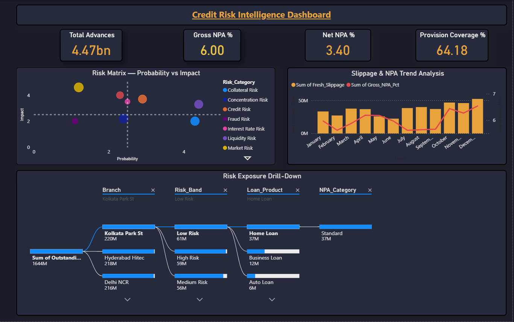
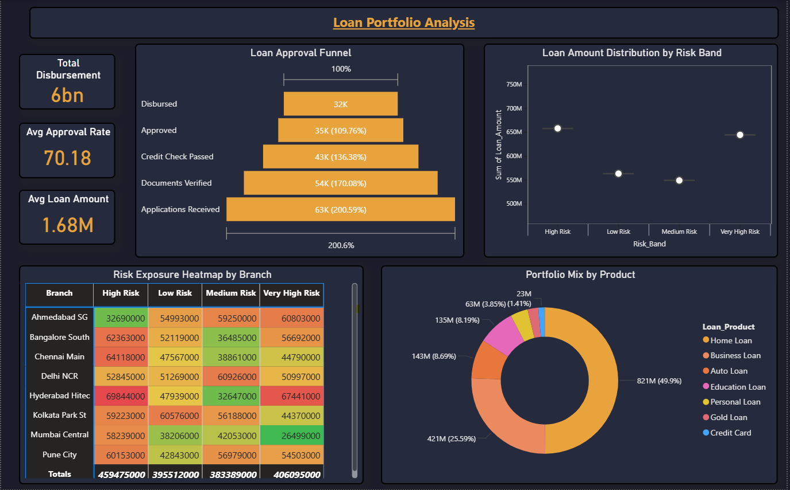
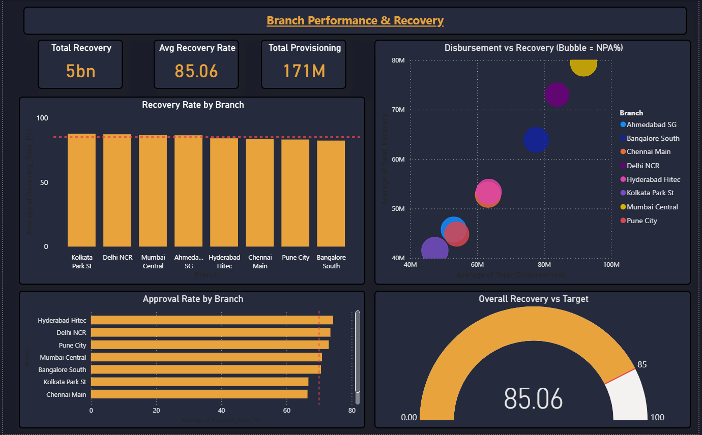

# Credit Risk & NPA Monitoring Dashboard — Power BI

## Overview
A 3-page banking risk dashboard built as a real-time 
Credit Risk Command Center — replacing reactive, 
weeks-old manual NPA reports.

## Problem Solved
Risk officers had no early-warning system for rising NPAs 
or branch-level concentration risk — acting only after 
accounts had already defaulted.

## Dashboard Pages
- Page 1 — Risk Overview (NPA KPIs, Risk Matrix, Decomposition Tree)
- Page 2 — Portfolio Analysis (Funnel, Box & Whisker, Risk Heatmap)
- Page 3 — Branch Performance (Recovery vs Target, Scatter, Gauge)

## Tools & Skills
Power BI | DAX | Power Query | Dark Theme UI |
Risk Matrix (Probability x Impact) | Funnel Chart |
Box & Whisker Plot | Decomposition Tree (AI) | Gauge Chart

## Key Insights
- Gross NPA: 6.00% | Net NPA: 3.40%
- Kolkata Park St branch — highest exposure (₹220M)
- Credit & Operational Risk in critical quadrant
- Recovery Rate: 85.06% — on target

## 📸 Dashboard Screenshots

### Page 1 — Risk Overview

### Page 2 — Portfolio Analysis

### Page 3 — Branch Performance

