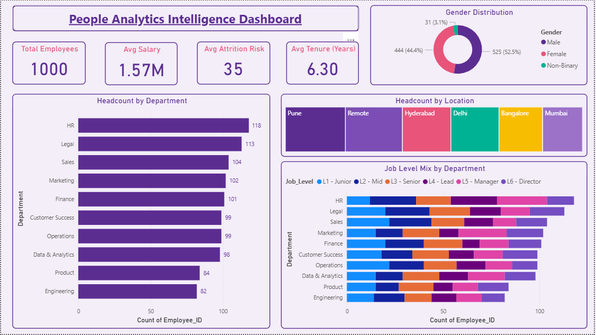
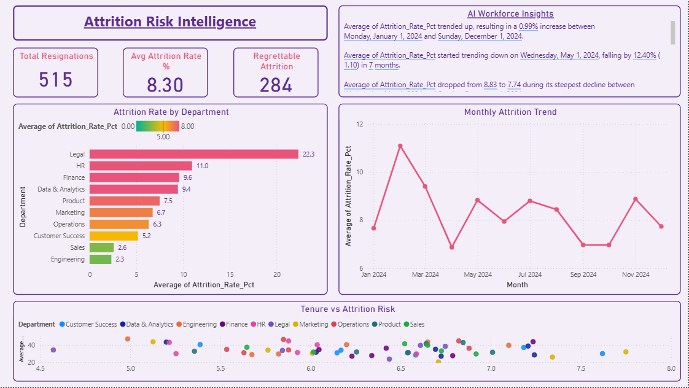
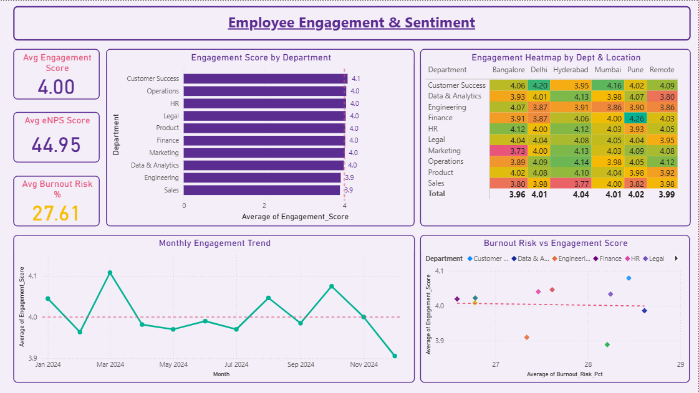
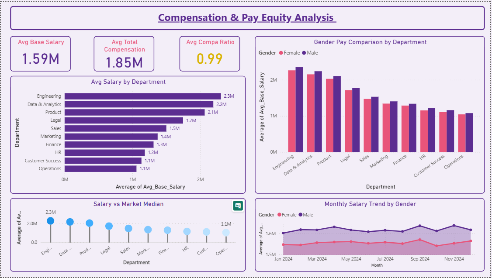
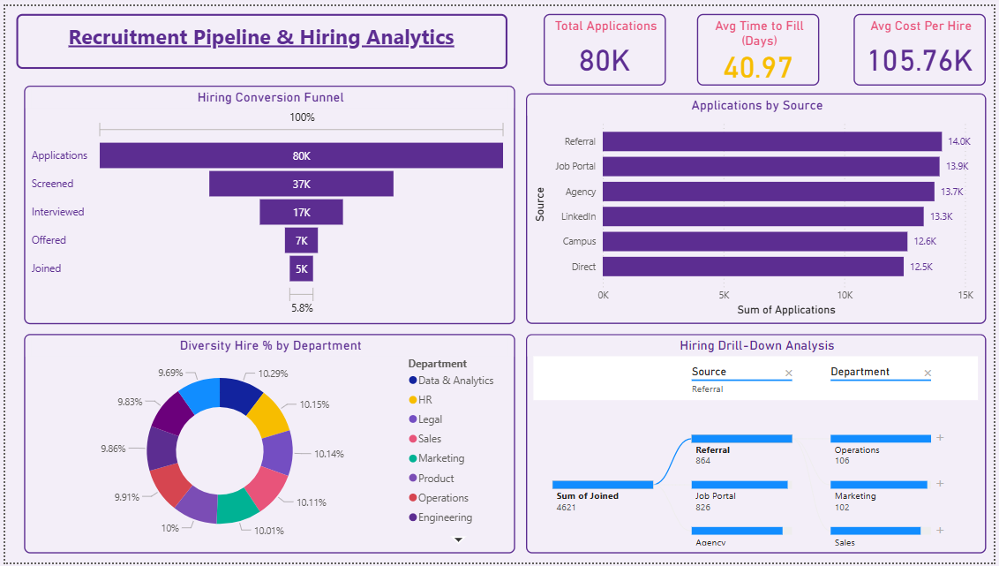

# HR People Analytics Intelligence Dashboard — Power BI

## Overview
A 5-page people analytics dashboard for a 1,000-employee 
tech company — replacing annual surveys and spreadsheets 
with real-time workforce visibility.

## Problem Solved
HR leadership had no real-time view of attrition risk, 
engagement trends, pay equity, or hiring efficiency — 
top talent was leaving before action could be taken.

## Dashboard Pages
- Page 1 — Workforce Overview (Headcount, Gender, Location, Level Mix)
- Page 2 — Attrition Risk (AI Smart Narrative, Risk Heatmap, Trend)
- Page 3 — Engagement & Sentiment (eNPS, Burnout Risk, Heatmap)
- Page 4 — Compensation & Pay Equity (Gender Pay Gap, Compa Ratio)
- Page 5 — Recruitment Pipeline (Funnel, Source Analysis, Diversity)

## Tools & Skills
Power BI | DAX | Power Query | Star Schema (6 tables) |
Smart Narrative (AI) | Decomposition Tree (AI) |
Dot Plot | 100% Stacked Bar | Conditional Formatting

## Key Insights
- Legal dept attrition: 22.3% — highest in company
- Gender pay gap visible across all departments
- Only 5.8% of applicants convert to joiners
- Burnout Risk: 27.61% — amber warning zone

## 📸 Dashboard Screenshots

### Page 1 — Workforce Overview

### Page 2 — Attrition Risk

### Page 3 — Engagement & Sentiment

### Page 4 — Compensation & Pay Equity

### Page 5 — Recruitment Pipeline

