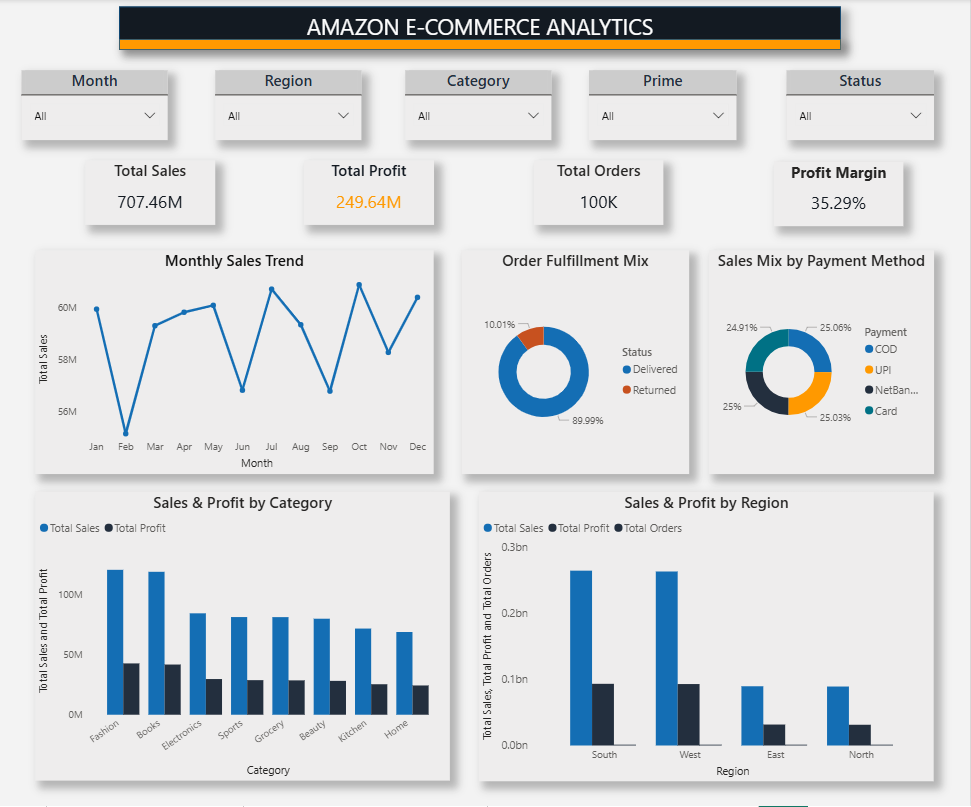
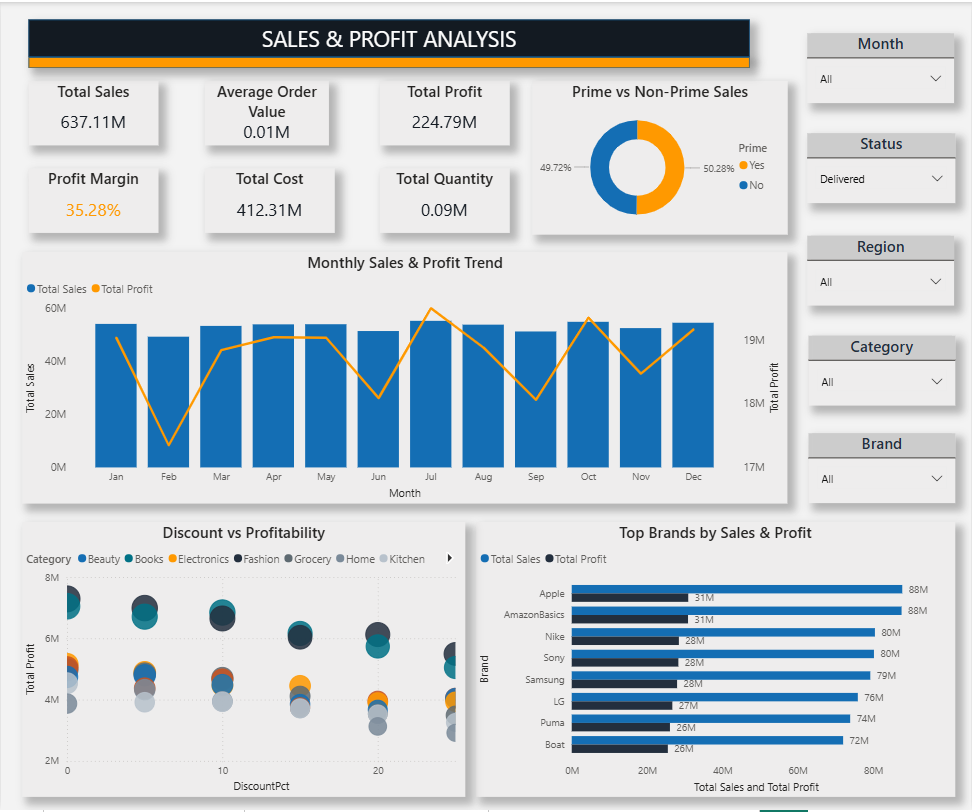
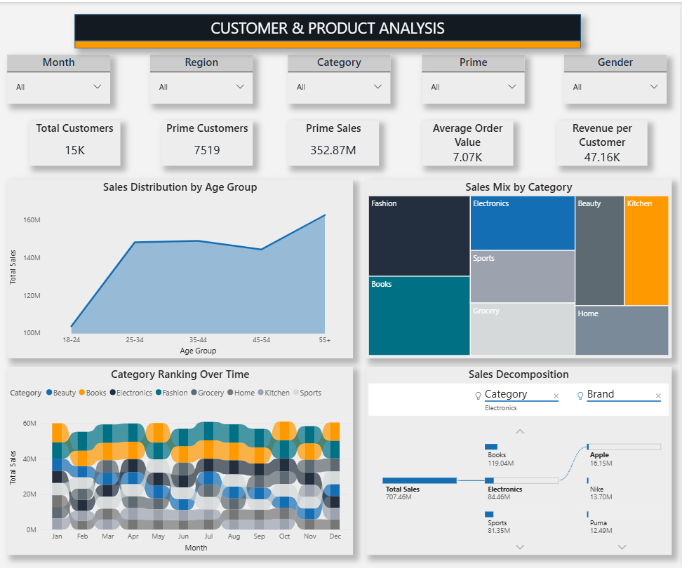
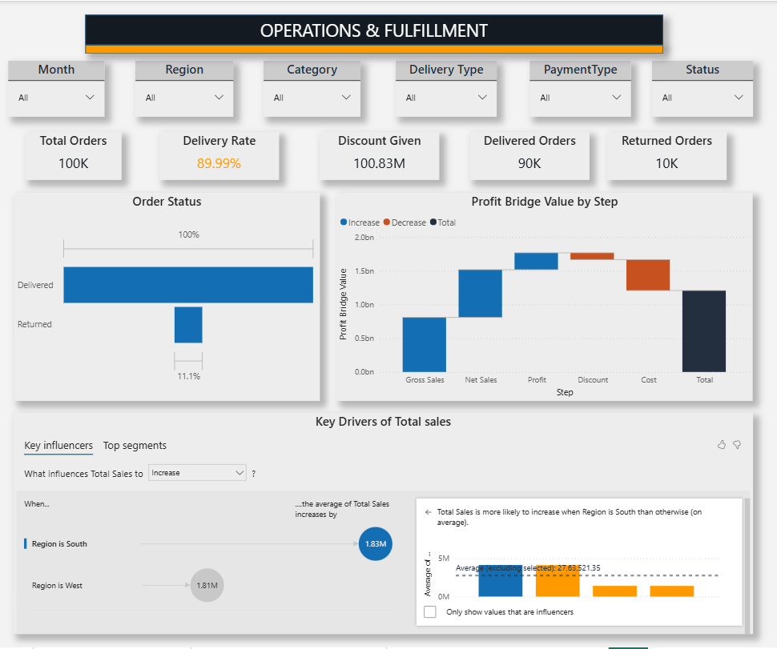

# Amazon E-Commerce Analytics Dashboard — Power BI

## Overview
A 4-page e-commerce analytics dashboard built on real 
Amazon sales data — giving sellers instant visibility 
into profitability, customer segments, and fulfillment.

## Problem Solved
Amazon sellers tracked hundreds of metrics in spreadsheets 
but couldn't answer: which category is truly profitable, 
where profit is leaking, or which region outperforms.

## Dashboard Pages
- Page 1 — E-Commerce Overview (Sales, Profit, Orders, Region)
- Page 2 — Sales & Profit Analysis (Brands, Discount vs Profit)
- Page 3 — Customer & Product Analysis (Age, Category, AI Tree)
- Page 4 — Operations & Fulfillment (Returns, Waterfall, AI Insights)

## Tools & Skills
Power BI | DAX | Power Query | Key Influencers (AI) |
Decomposition Tree | Ribbon Chart | Waterfall Chart |
Scatter Plot | Treemap | Slicers

## Key Insights
- Total Sales: ₹707M | Profit Margin: 35.29%
- 10K returns = bigger profit leak than discounts
- South region drives ₹1.83M more per transaction
- 55+ age group = highest spending segment

## 📸 Dashboard Screenshots

### Page 1 — E-Commerce Overview

### Page 2 — Sales & Profit Analysis

### Page 3 — Customer & Product Analysis

### Page 4 — Operations & Fulfillment

